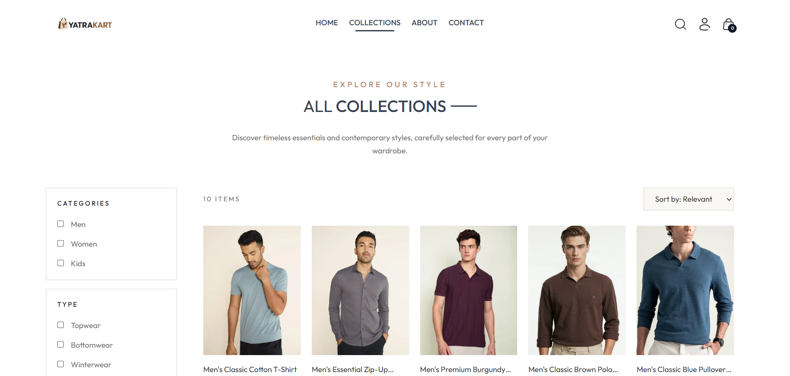
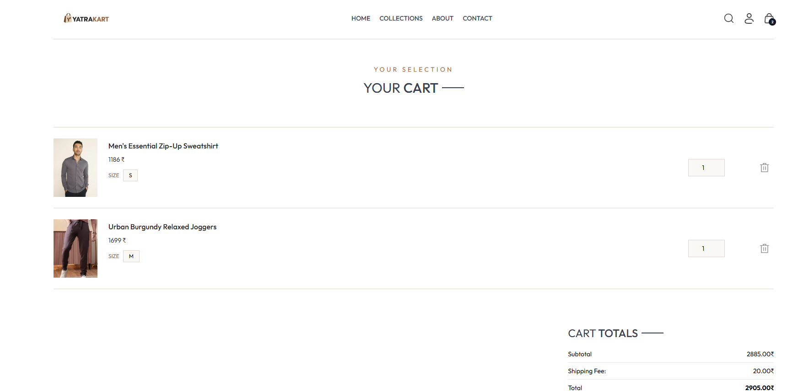
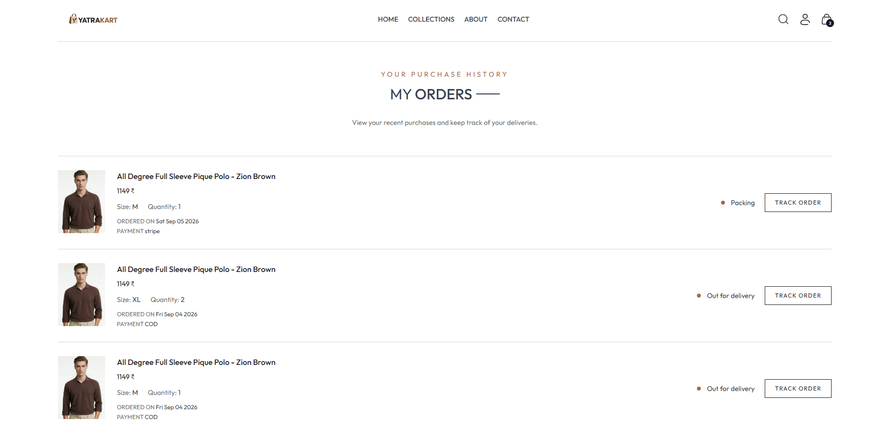
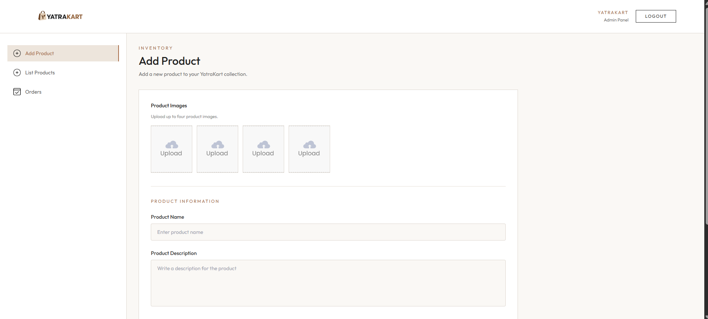

<h1>🛍️ YatraKart — Full-Stack E-Commerce Platform</h1>

  <strong>YatraKart</strong> is a full-stack e-commerce platform built with the
  <strong>MERN stack</strong>. It provides a complete shopping experience with
  product browsing, search, filtering, cart management, authentication,
  checkout, online payments, order history, and order tracking.
  A separate admin panel is included for managing products and customer orders.

  <strong>Frontend:</strong> React &nbsp; | &nbsp;
  <strong>Backend:</strong> Node.js + Express &nbsp; | &nbsp;
  <strong>Database:</strong> MongoDB &nbsp; | &nbsp;
  <strong>Payments:</strong> Stripe &nbsp; | &nbsp;
  <strong>Images:</strong> Cloudinary

<h2>📌 About the Project</h2>

  YatraKart is designed as a modern e-commerce application where customers
  can discover products, search and filter the catalog, manage their shopping
  cart, place orders, make payments, and track their orders.

  The project also includes a dedicated admin dashboard where administrators
  can add and remove products and manage customer orders.

<h2>✨ Key Features</h2>

<h3>🛒 Customer Features</h3>

<ul>
  <li>
    <strong>Product Browsing</strong> — Browse the latest collections and
    best-selling products.
  </li>

  <li>
    <strong>Product Search</strong> — Search products by name using the
    global search bar.
  </li>

  <li>
    <strong>Category Filtering</strong> — Filter products by category such as
    Men, Women, and Kids.
  </li>

  <li>
    <strong>Subcategory Filtering</strong> — Further filter products by
    Topwear, Bottomwear, and Winterwear.
  </li>

  <li>
    <strong>Product Sorting</strong> — Sort products by price from low to high
    or high to low.
  </li>

  <li>
    <strong>Product Details</strong> — View product images, descriptions,
    prices, available sizes, and related products.
  </li>

  <li>
    <strong>Shopping Cart</strong> — Add products with selected sizes, update
    quantities, and remove items.
  </li>

  <li>
    <strong>Persistent Cart</strong> — Authenticated users' carts are stored
    in MongoDB and restored after login.
  </li>

  <li>
    <strong>User Authentication</strong> — Register and log in using JWT-based
    authentication.
  </li>

  <li>
    <strong>User Profile</strong> — View account information such as name and
    email.
  </li>

  <li>
    <strong>Checkout</strong> — Enter delivery information and choose a
    payment method.
  </li>

  <li>
    <strong>Cash on Delivery</strong> — Place orders using COD.
  </li>

  <li>
    <strong>Stripe Payments</strong> — Complete online payments using
    Stripe Checkout.
  </li>

  <li>
    <strong>Order History</strong> — View previously placed orders and their
    details.
  </li>

  <li>
    <strong>Order Tracking</strong> — View the current status of an order.
  </li>

  <li>
    <strong>Responsive Design</strong> — Customer interface works across
    desktop and mobile screen sizes.
  </li>
</ul>

<h3>🔑 Admin Features</h3>

<ul>
  <li>
    <strong>Admin Authentication</strong> — Secure login for administrators.
  </li>

  <li>
    <strong>Add Products</strong> — Add products with name, description,
    price, category, subcategory, sizes, images, and bestseller status.
  </li>

  <li>
    <strong>Product Management</strong> — View products currently available
    in the store.
  </li>

  <li>
    <strong>Delete Products</strong> — Remove products using their MongoDB
    product ID.
  </li>

  <li>
    <strong>Cloudinary Uploads</strong> — Product images are uploaded and
    hosted using Cloudinary.
  </li>

  <li>
    <strong>Order Management</strong> — View customer orders and order details.
  </li>

  <li>
    <strong>Order Status Updates</strong> — Update order status from the
    admin dashboard.
  </li>

  <li>
    <strong>Cart Synchronization</strong> — When a product is deleted,
    it is also removed from users' saved carts.
  </li>
</ul>

<h2>🧠 How the Application Works</h2>

<h3>Customer Flow</h3>

<pre>
User
 ↓
React Frontend
 ↓
Browse / Search / Filter Products
 ↓
Product Details
 ↓
Select Size
 ↓
Add to Cart
 ↓
Checkout
 ↓
COD / Stripe
 ↓
Order Created
 ↓
Order History
 ↓
Order Tracking
</pre>

<h3>Backend Flow</h3>

<pre>
React Frontend
      ↓
     Axios
      ↓
Express.js REST API
      ↓
Controllers
      ↓
Mongoose Models
      ↓
MongoDB
</pre>

<h3>Product Image Flow</h3>

<pre>
Admin uploads image
       ↓
Backend
       ↓
Cloudinary
       ↓
Cloudinary returns image URL
       ↓
MongoDB stores product data + image URL
       ↓
Frontend displays image
</pre>

<h3>Stripe Payment Flow</h3>

<pre>
Customer Checkout
       ↓
Frontend sends order information
       ↓
Backend creates Stripe Checkout Session
       ↓
Customer completes payment on Stripe
       ↓
Stripe redirects to verification page
       ↓
Backend verifies the payment
       ↓
Order payment status is updated
       ↓
Customer is redirected to Orders
</pre>

<h2>🏗️ Project Architecture</h2>

<pre>
YatraKart/
│
├── frontend/
│   ├── src/
│   │   ├── assets/
│   │   ├── components/
│   │   ├── context/
│   │   ├── Pages/
│   │   ├── App.jsx
│   │   └── main.jsx
│   ├── public/
│   ├── .env
│   └── package.json
│
├── backend/
│   ├── config/
│   ├── controllers/
│   ├── middleware/
│   ├── models/
│   ├── routes/
│   ├── server.js
│   ├── .env
│   └── package.json
│
├── admin/
│   ├── src/
│   │   ├── components/
│   │   ├── pages/
│   │   ├── assets/
│   │   └── App.jsx
│   ├── public/
│   ├── .env
│   └── package.json
│
├── README.md
└── .gitignore
</pre>

<h2>💻 Technology Stack</h2>

<h3>Frontend</h3>

<ul>
  <li>React.js</li>
  <li>React Hooks</li>
  <li>React Router</li>
  <li>Context API</li>
  <li>Axios</li>
  <li>Tailwind CSS</li>
</ul>

<h3>Backend</h3>

<ul>
  <li>Node.js</li>
  <li>Express.js</li>
  <li>MongoDB</li>
  <li>Mongoose</li>
  <li>REST APIs</li>
</ul>

<h3>Authentication</h3>

<ul>
  <li>JWT (JSON Web Tokens)</li>
  <li>bcrypt</li>
</ul>

<h3>Third-Party Services</h3>

<ul>
  <li>Stripe — Online payment processing</li>
  <li>Cloudinary — Product image hosting</li>
</ul>

<h2>📂 Main Application Areas</h2>

<table>
  <tr>
    <th>Application</th>
    <th>Purpose</th>
  </tr>

  <tr>
    <td><strong>Frontend</strong></td>
    <td>Customer shopping interface</td>
  </tr>

  <tr>
    <td><strong>Backend</strong></td>
    <td>REST API, authentication, orders, cart, products, and payments</td>
  </tr>

  <tr>
    <td><strong>Admin</strong></td>
    <td>Product and order management dashboard</td>
  </tr>
</table>

<h2>⚙️ Installation</h2>

<h3>1. Clone the Repository</h3>

<pre>
<code>
git clone https://github.com/vikaspareek-vp/yatrakart.git
cd yatrakart
</code>
</pre>

Replace <code>YOUR_GITHUB_REPOSITORY_URL</code> with your GitHub repository URL.

<h3>2. Install Dependencies</h3>

<strong>Frontend</strong>

<pre>
<code>
cd frontend
npm install
</code>
</pre>

<strong>Backend</strong>

<pre>
<code>
cd ../backend
npm install
</code>
</pre>

<strong>Admin</strong>

<pre>
<code>
cd ../admin
npm install
</code>
</pre>

<h2>🔐 Environment Variables</h2>

Create a <code>.env</code> file in the <code>backend</code> directory:

<pre>
<code>
MONGO_URI=&lt;your-mongodb-connection-string&gt;
JWT_SECRET=&lt;your-jwt-secret&gt;

ADMIN_EMAIL=&lt;your-admin-email&gt;
ADMIN_PASSWORD=&lt;your-admin-password&gt;

STRIPE_SECRET_KEY=&lt;your-stripe-secret-key&gt;

CLOUDINARY_CLOUD_NAME=&lt;your-cloudinary-cloud-name&gt;
CLOUDINARY_API_KEY=&lt;your-cloudinary-api-key&gt;
CLOUDINARY_API_SECRET=&lt;your-cloudinary-api-secret&gt;
</code>
</pre>

Create a <code>.env</code> file in the <code>frontend</code> directory:

<pre>
<code>
VITE_BACKEND_URL=http://localhost:4000
</code>
</pre>

Create a <code>.env</code> file in the <code>admin</code> directory:

<pre>
<code>
VITE_BACKEND_URL=http://localhost:4000
</code>
</pre>

<strong>Security:</strong> Never commit your <code>.env</code> files or secret
keys to GitHub. Add them to <code>.gitignore</code>.

<h2>▶️ Running the Project</h2>

<h3>Start the Backend</h3>

<pre>
<code>
cd backend
npm run dev
</code>
</pre>

The backend runs on:

<pre>
<code>
http://localhost:4000
</code>
</pre>

<h3>Start the Customer Frontend</h3>

<pre>
<code>
cd frontend
npm run dev
</code>
</pre>

<h3>Start the Admin Panel</h3>

<pre>
<code>
cd admin
npm run dev
</code>
</pre>

<h2>📸 Screenshots</h2>

  Screenshots of the YatraKart customer website and admin dashboard.

<table>
  <tr>
    <th>Home</th>
    <th>Collection</th>
    <th>Product</th>
  </tr>

  <tr>
    <td>
      
    </td>
    <td>
      
    </td>
    <td>
      
    </td>
  </tr>
</table>

 

<table>
  <tr>
    <th>Cart</th>
    <th>Orders</th>
    <th>Admin Panel</th>
  </tr>

  <tr>
    <td>
      
    </td>
    <td>
      
    </td>
    <td>
      
    </td>
  </tr>
</table>

<h2>🔒 Security Practices</h2>

<ul>
  <li>Passwords are hashed using bcrypt.</li>
  <li>JWT tokens are used for authenticated requests.</li>
  <li>Admin authentication is handled through protected backend credentials.</li>
  <li>Stripe secret keys are stored in environment variables.</li>
  <li>Cloudinary credentials are stored in environment variables.</li>
  <li>Environment files containing secrets are excluded from Git.</li>
</ul>

<h2>🔮 Future Improvements</h2>

<ul>
  <li>⭐ Product reviews and ratings</li>
  <li>❤️ Wishlist functionality</li>
  <li>🎟️ Discount and coupon system</li>
  <li>📧 Email notifications for orders</li>
  <li>📊 Sales analytics for the admin dashboard</li>
  <li>📦 Advanced inventory management</li>
</ul>

<h2>🤝 Contributing</h2>

  Contributions, suggestions, and improvements are welcome.
  Feel free to fork the repository and submit a pull request.

<h2>👨‍💻 Project</h2>

  <strong>YatraKart</strong> — Full-Stack E-Commerce Platform

  Built using the MERN stack with Stripe and Cloudinary integration.

  <strong>⭐ If you find YatraKart useful, consider giving the repository a star!</strong>

